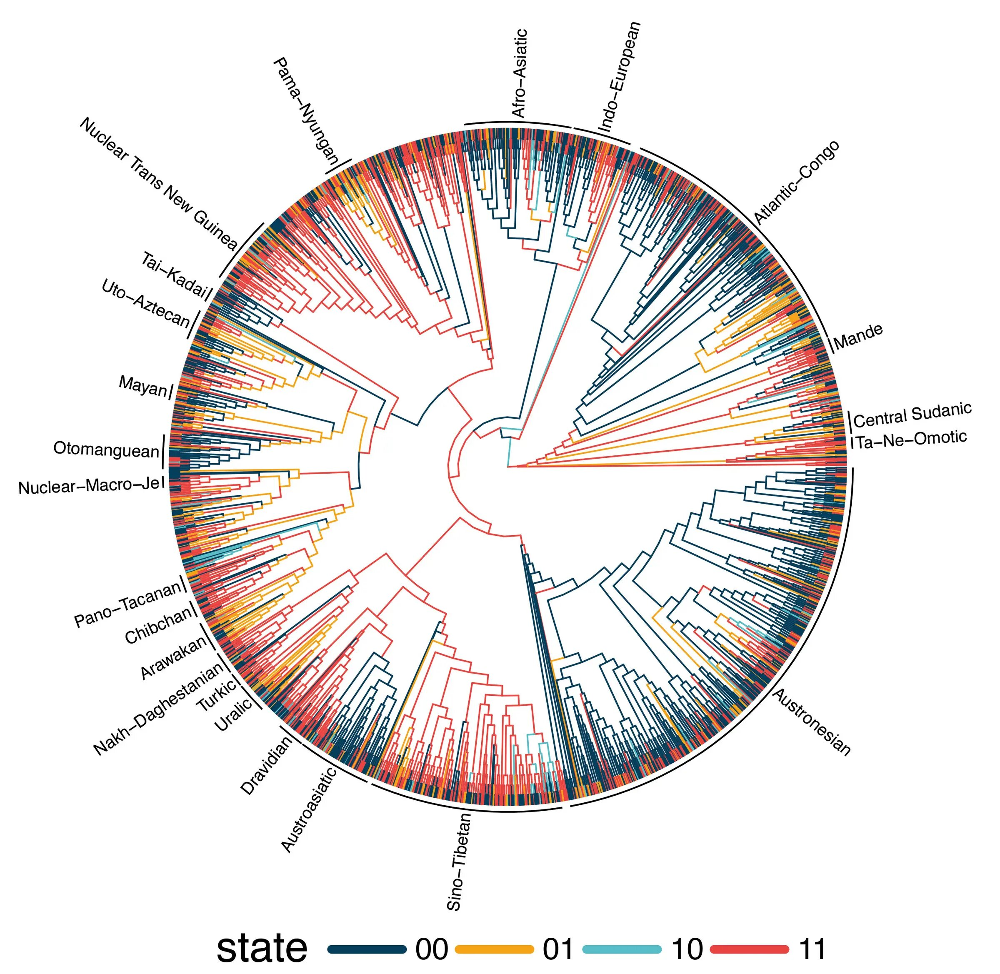

# Language families and the connection to Noah's family

Connect language families with the spread of Noah's family after the flood.

The Wikipedia articles about language families in [German](https://de.wikipedia.org/wiki/Sprachfamilie) and [English](https://en.wikipedia.org/wiki/Language_family) contain some nice world maps already.

## Procedural generation

It might be possible to create a SVG or PDF with python and the [GeoPandas](https://geopandas.org/en/stable/) package (on [Github](https://github.com/geopandas/geopandas)). Relevant maps in the SGX format might be available at Kaggle.

- [Making colored country maps with real data using matplotlip and Geopandas](https://medium.com/analytics-vidhya/making-colored-country-maps-with-real-data-using-matplotlib-and-geopandas-2d10687ca7ac)
- [How to make colored country maps in Python TLDR edition](https://medium.com/@protobioengineering/how-to-make-colored-country-maps-in-python-tldr-edition-d58147105a8d)
- [Choropleth Map Tutorial on Github](https://github.com/aero-man/choropleth-map-tutorial)
- https://koordinates.com/layer/3824-nz-police-district-boundaries/
- [Data model (GIS)](https://en.wikipedia.org/wiki/Data_model_(GIS))
- [Choropleth map](https://en.wikipedia.org/wiki/Choropleth_map)
- [Shapefile](https://en.wikipedia.org/wiki/Shapefile)

## Editing a vector file

Now that [Affinity is freely available](https://www.affinity.studio/), we could just start with a vector file to represent our current state. Over time we update, and document changes.

## Enduring constraints on grammar revealed by Bayesian spatiophylogenetic analyses

In a [post on phys.org](https://phys.org/news/2025-11-patterns-world-languages-grammatical-universals.html) I found the structural connection between 23 languages and how patterns ([linguistic universal](https://en.wikipedia.org/wiki/Linguistic_universal)) appeared over time in most of them. The original article was [posted on nature.com](https://www.nature.com/articles/s41562-025-02325-z) on November 17th, 2025.

## History

- 2025/08/27 This idea started on in August in Nha Trang during a conversation with Brandon from Spokane. He created a map in 2005 with Photoshop, and the idea of an updated vector edition was born.
- 2025/10/10 In a conversation with Carlo this topic apeared again. He studied Geography in Rome, Italy and investigated the hypothesis of [Altaic languages](https://en.wikipedia.org/wiki/Altaic_languages). This will be a great addition to this project
- 2025/11/17 An article on nature.com [Enduring constraints on grammar revealed by Bayesian spatiophylogenetic analyses](https://www.nature.com/articles/s41562-025-02325-z) talks about some [Linguistic universals](https://en.wikipedia.org/wiki/Linguistic_universal) in 23 language groups
